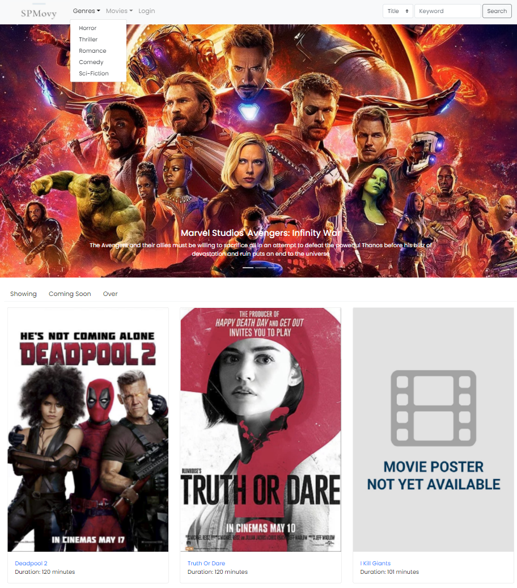

# SPMovy - Enterprise-Level Movie Booking System

SPMovy is a full-fledged moving booking system that addresses the needs of modern cinema operators by providing features such as:

- Public User Functionalities:
  - User movie booking system 
    - Seat Selection.
    - Shopping Cart that supports multi-movie bookings.
    - PayPal Payment.
    - Resumption of interrupted booking.
    - Safety mechanism that prevents race condition of multiple users booking for the same ticket at same time.
  - Dynamic latest movie ticket/seat availability display. 
    - Ticket/seat on hold before payment.
    - Released for booking if payment unsuccessful.
  - Movie search system based on movie title, actor and genre.
  - Movie review/rating system.
  - User registration system.
  - User account management system. (Update profile, password and etc.)
  - User movie booking records display.
- Admin User Functionalities:
  - Multi-cinema movie scheduling system.
  - Backend movie management system.
  - User management system.
  - Movie review management system. 
  - Movie sale reporting system.

SPMovy is developed with Web Vulnerabilities in mind. It is coded with security best practices in mind, ensuring the application is not exploitable to attacks such as:

- Cross-site Scripting (XSS)
- Cross-site Request Forgery (CSRF)
- SQL Injection (SQLi)
- Bruteforce Attack
- Session Fixation attack
- Session Hijacking attack

## Table of Content 

1. [Technologies Used](#technologies-used)
2. [SPMovy Features in Pictures](#spmovy-features-in-pictures)
3. [Database Design](#database-design)
4. [Setup Instructions](#setup-instructions)

## Technologies Used

- Model-Viewer-Controller (MVC)
- Servlets
- Java Servlet Page (JSP)
- Java Standard Tag Library (JSTL)
- Java DataBase Connectivity (JDBC) 
- PreparedStatement
- Stored Procedures
- Database Transaction Autocommit/Autorollback
- Database Connection Pool
- MySQL
- Tomcat
- Bootstrap

## SPMovy Features in Pictures

### Public - Homepage 

- Movies categroised into *"Showing"*, *"Coming Soon"*, *"Over"*.
- Movies categorised into genres.

### Public - Movie Search Page

- Search movie based on Title or Actor

### Public - Movie Details Page

- Multi-cinemas support with a movie scheduled at different timings at different cinemas.
- Hover over a schedule timing to display the latest available tickets (Available tickets = Total tickets set - Tickets booked - Tickets on hold).
- Schedule greyed out when all the tickets have been on hold.
- Movie review & rating system.
- Robust against web vulnerabilities such as XSS as untrusted inputs are heavily validated and at the earliest stage and escaped at the latest stage.
  
### Public - Movie Booking Pages

- After entering the quantity of 2 movie tickets and pressed "Next", At this point, the 2 tickets are already reserved for the user by inserting records in the database with “hold” for the status of the booking. In the movie details page, the tickets available for this schedule for this movie has decreased by 2. So at any point of time, the number of tickets available is always the latest.

 

- Seat selection page which displays all the available seats, with sold seats greyed out.
- Since the quantity selected was 2, it will show warning if try to select 3 seats. 
- Will also show warning If select only 1 seats and press next.
- After seat selection, the booking will be added to user's shopping cart and ready for payment.
- Backend security mechanism to ensure sold seats are not allowed to be booked again even when user attempts parameter tampering to change the seat selected in HTTP request to seats that have been sold.

 

- Shopping cart page displays the details of the booking of the user E.g. Title, Cinema, Date, Time, Qty, Seats, and Total Price
- Shopping cart in the session is able to store multiple movie bookings. 
- A user does not need to finish the booking once started to confirm the booking. He or she has the flexibility to add all the movies he or she wants to watch into shopping cart and checkout out in one goal.
- When the user logs out, or his session timeout, all his unpaid bookings will be cleared from his shopping cart, releasing the reserved seats back into the pool of available tickets for other users to book. 

 

- Checkout summary page to ask user to confirm on the details on his booking before payment.
- Shows user his user information and user is able to update his particulars such as credit card if it is changed.

 

- SPMovy is integrated with PayPal payment system and allows users to pay with PayPal.
- For development, PayPal sandbox is used.

 

- Booking successful page. At this point, the booking with seats selected are confirmed and updated in the backend database.

#### How do SPMovy prevent race condition when two user try to book the ticket at the same time?

> It is done by setting the database connection’s autocommit to false. A stored procedure which add the booking to the booking table, which then updates the available ticket in the schedule table for the corresponding schedule. Finally, it selects the latest tickets available for that schedule and returns. Then backend logic will check if the latest tickets available is negative, if it is that means the race condition happened, then the database connection is rolled back.

### Public - User Registration Page

- Public users must login/register before he can book a movie ticket. If not, will be prompted to login page
- In registration page all input fields are validated using JavaScript regex in frontend and Java regex in servlet in backend.
- Username must be unqiue as it is the primary key in backend user table. 

### Public - User Profile Page

- User particulars will be displayed
- User is able to change password. Input box is again validated like the registration page
- User is able to update personal information, with old information already retrieved from database and placed in the input box for convenience of user.

### Public - View All User's Booking

- Any access to these member-only pages by url will be redirected to login page.

### Admin - Admin Page

- Admin is able to get an overview of all the movies currently in SPMovy.
- Admin is able to add new movie or genre easily from the navigation bar above.

### Admin - Movie Management Page

- Admin is able to update a movie's information such as Title, Actor List, Synopsis, Duration, Status and setc.
- Admin is able to upload a poster for the particular movie.
- Admin is able to manage the genre that this movie belongs to.
- Admin is able to manage the reviews of the movie.
- Admin is able to remove the poster uploaded for the movie.
- Admin is able to delete the movie.
- Admin is able to manage the schedules for this movie at different cinemas.

### Admin - Movie Scheduling Page

- Admin is able to add new schedule(s) for the movie at a particular cinema.
- Admin is able to set different number of tickets available for each schedule at different cinema.
- Admin is able to set different price of each ticket of different schedule at different cinema.
- Admin is able to delete a schedule for a movie at different cinema. 

### Admin - Movie Sale Reporting System

- Admin is able to view reports of top selling movies for a particular month.

## Database Design

## Setup Instructions

### Pre-requisites

SPMovy is developed with:

- Java SE Runtime 8
- Tomcat v9.0
- MySQL 5.7

Ensure you have the above installed or any equvialent that you are sure will work before deploying SPMovy.

### Setup the Database

1. The `SPMovy_CA2-database.sql` contains all the SQL commands to setup the database described in [Database Design](#database-design) for SPMovy web application with stored procedures required, default admin user, testing public user accounts and pre-populated movies for demonstration.
2. Run and execute all the SQL commands in `SPMovy_CA2-database.sql` in your SQL server instance to create the `assignment` schema. 
3. Check under the newly created `assignment` schema, there are tables as descirbed in Database Design section.

### Setup SPMovy Web Application on Tomcat

1. The `SPMovy_CA2` folder contains all the source code of SPMovy that is required to setup it with Tomcat.
2. For development, IDE such as Eclipse can be used to import the entire `SPMovy_CA2` project folder. Make sure you configure the project's build path to include Tomcat v9.0 and JRE 8 before serving the application with Tomcat to see SPMovy in action.
3. For production, deployment can varies depending on the situation. It is beyond the scope of this setup guide. Just give me some credit if SPMovy helped your cinema's own movie booking application.

### Setup SPMovy to use Database Connection Pool maintained by Tomcat

1. Open `SPMovy_CA2/WebContent/META-INF/context.xml`, the username and password for your MySQL database should be configured here. The web container (Tomcat) will read this context.xml before loading the web application.
2. Inside context.xml, the connection to MySQL database is declared as a resource. In the declaration, the user and password of your MySQL database should be entered with the “username” and “password” attribute as shown by below, so Tomcat is able to maintain a pool of database connections for SPMovy.

    ~~~xml
    <Context>
      <Resource 
        name="jdbc/assignment"
        auth="Container"
        type="javax.sql.DataSource"
        maxTotal="100"
        maxIdle="30"
        maxWaitMillis="10000"
        driverClassName="com.mysql.jdbc.Driver"
        url="jdbc:mysql://<url:port>/assignment"
        username="<username>"
        password="<password>"
      >
    </Context>
    ~~~

### Setup Upload Directories for Movie & Genre Images

1. The `SPMovy_CA2/WebContent/upload.properties` file is the file which SPMovy will read to determine where SPMovy will store all the movie posters and genre images uploaded by admin.
2. Please set the proper directory. Ensure the service account of Tomcat process has read and write permission to the directories you set.

> Now SPMovy is ready and see it in action by browsing to http://localhost:8080/SPMovy_Final/index.jsp

### Default Admin Account, Public User Testing Account & PayPal Payment Account

- After getting SPMovy up and running with your Tomcat instance, you can explore the functionalities of SPMovy with the following default accounts setup with SPMovy database.
  - For Administrator:
    - UserID: admin
    - Password: admin
  - For Public User:
    - UserID: test
    - Password: test
- You will need to register a PayPal Sandbox Testing Account and top it up with fake balance to experience the payment feature. You will need to login with the PayPal Sandbox Account you regitered when prompted to pay to complete the checkout your movie booking(s).

### Setup Tomcat to use HTTPS (Optional)
1. Generate a Public & Private Key pair and certificate
2. Set up Tomcat to use the cert generated.
3. Add the following to Tomcat's server.xml
   
   ~~~xml
   
    <Connector SSLEnabled="true" clientAuth="false" keystoreFile="<path to cert>" keystorePass="<private key password" maxThreads="150" port="<port>" protocol="org.apache.coyote.http11.Http11NioProtocol" scheme="https" secure="true" sslProtocol="TLS"/>
      
   ~~~

4. Edit `SPMovy_CA2/WEB-INF/web.xml` and add the following.
   
   ~~~xml
   <security-constraint>
    <web-resource-collection>
      <web-resource-name>SPMovy_Final</web-resource-name>
      <url-pattern>/*</url-pattern>
    </web-resource-collection>
    <user-data-constraint>
      <transport-guarantee>CONFIDENTIAL</transport-guarantee>
    </user-data-constraint>
  </security-constraint>
   ~~~